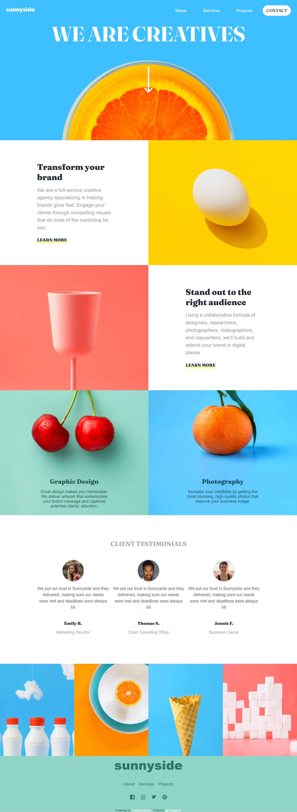

# Frontend Mentor - Sunnyside agency landing page solution

This is a solution to the [Sunnyside agency landing page challenge on Frontend Mentor](https://www.frontendmentor.io/challenges/sunnyside-agency-landing-page-7yVs3B6ef). Frontend Mentor challenges help you improve your coding skills by building realistic projects.

## Table of contents

- [The challenge](#the-challenge)
- [Screenshot](#screenshot)
- [Links](#links)
- [Built with](#built-with)
- [What I learned](#what-i-learned)
- [Useful resources](#useful-resources)
- [Author](#author)

### The challenge

Users should be able to:

- View the optimal layout for the site depending on their device's screen size
- See hover states for all interactive elements on the page

### Screenshot



### Links

- Solution URL: [ solution URL ](https://github.com/Psargar616/sunnyside-agency-landing-page-main)
- Live Site URL: [ live site URL ](https://psargar616.github.io/sunnyside-agency-landing-page/)

### Built with

- Semantic HTML5 markup
- CSS custom properties
- Flexbox
- CSS Grid
- Mobile-first workflow

### What I learned

I learned to add a few animations and responsive navbar

```
gsap.registerPlugin(ScrollTrigger, ScrollSmoother);

ScrollTrigger.normalizeScroll(true);

// create the smooth scroller FIRST!
let smoother = ScrollSmoother.create({
  smooth: 1,
  effects: true,
  normalizeScroll: true,
});


```

### Useful resources

- [gsap.com](https://gsap.com/docs/v3/Plugins/ScrollSmoother/)

## Author

- Frontend Mentor - [@Psargar616](https://www.frontendmentor.io/profile/Psargar616)
- Twitter - [@PranjaliSargar](https://twitter.com/PranjaliSargar)
